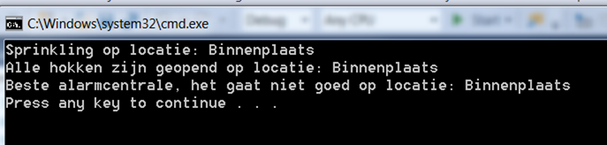

## Opdracht: C# Gevorderd - Delegates en Events

| **Complexiteit** | **Moment** | **Scaffold** | **Ondersteuning** | **Onderwerpen**                                                |
|------------------|------------|--------------|------------------|----------------------------------------------------------------|
| Gevorderd        | College    | Ja           | Ja               | Delegates, Events |

### Beschrijving
Dierentuin Porkies is wat verouderd. Zo beschikt de dierentuin wel over een brandslang en een sprinklerinstallatie, 
maar dat moet allemaal handmatig worden aangestuurd. Nu Marianne Thieme bijna president wordt, moet daar verandering 
in komen. Daarom gaat de dierentuin investeren in een geautomatiseerd systeem. 
Zodra er een melding binnenkomt dat er rook is, dan moet er een melding naar de alarmcentrale gaan. 
Ook moet de sprinklerinstallatie in dat geval worden aangezet, omdat de aanrijtijd van de brandweer te lang is 
en dat tot gevolg zou hebben dat de dieren geroosterd zouden worden. Tenslotte beschikt het systeem over de mogelijkheid 
om de verblijven open te zetten. Dit heeft natuurlijk gevolgen voor de bezoekers van de dierentuin, 
maar het welzijn van de dieren staat bij uitstek voorop.

### Functionele vereisten
- Zodra rook is gemeld 
  - wordt dit aan de alarmcentrale doorgegeven
  - wordt de sprinkler installatie aangezet
  - worden de dierenverblijven open gezet

### Niet-functionele vereisten
- De applicatie is een console applicatie
- De applicatienaam is niet gelijk aan 'AlarmSysteem' omdat dit conflicteert met de klasse `AlarmSysteem`
- De meldingen en uitvoeren van taken wordt geregeld via delegates en events

### Testprocedure
1. Start de console applicatie (waarin de taken worden geregistreerd en alarm wordt geslagen)
2. Controleer de output en vergelijk die met de afbeelding:
   

### Testresultaat
- Geen verschil tussen output in console en onderstaande afbeelding:

### Ondersteunende informatie

**Signatuur van de delegate**  
Een delegate `AlarmTaak` kan de volgende signatuur hebben:  
a. Returntype: void  
b. Parameter: locatie (string)

**klasse `AlarmSysteem`**  
De klasse `AlarmSysteem` kan een property `AlarmTaken` van het type `AlarmTaak` bevatten. De klasse `AlarmSysteem` 
heeft een methode `AlarmSlaan` die één parameter heeft: locatie (string). Zorg ervoor dat de alarmtaken worden 
uitgevoerd als deze methode wordt aangeroepen. Houd er rekening mee dat property `AlarmTaken` `null` kan zijn.

**klasse `Program`**  
Maak in de methode Main van klasse Program een instantie van AlarmSysteem en roep vervolgens de methode `AlarmSlaan` 
aan met een locatie. Het is niet toegestaan om als locatie t5.50 mee te geven ;-). 

**klasse `AlarmTakenCollectie**  
In deze klasse kun je een aantal (`static`) methoden opnemen (Sprinkler, AlarmCentraleInlichten, HokkenOpenZetten).

