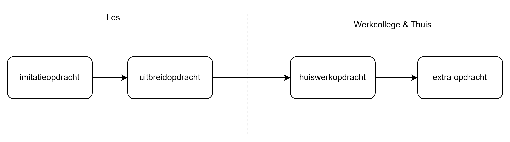

# CS

## Werkwijze
Hieronder een schematische weergave van de soorten opdrachten.

### Imitatieopdracht
Dit zijn de opdrachten die in de PowerPoint bestanden staan en die (zoveel mogelijk) door de docent voorgedaan zijn.

### Uitbreidopdracht
Dit zijn opdrachten die altijd een gedeeltelijke uitwerking (voorbeeld code) bevatten waar je een uitbreiding op doet.

### Huiswerkopdracht
Dit zijn opdrachten waarin een grotere mate van vrijheid zit en vaak verschillende oplossingen als uitwerking mogelijk zijn. Deze opdrachten zijn een goede oefening om zelfstandigheid te ontwikkelen en object oriëntatie toe te passen en je voor te bereiden op het niveau van de toetsen.

### Extra opdracht 
De extra opdrachten zijn optioneel, deze zijn ook niet beschikbaar bij alle onderwerpen. Ze zijn bedoeld als extra uitdaging. Sommige huiswerk- en aftekenopdrachten bevatten ook een 'extra uitdaging' gedeelte. 

### Aftekenopdracht
Tijdens deze periode maak je twee opdrachten die genoteerd worden in Educator, die gelden dus als een toets onderdeel. Deze opdrachten vind je in de map: Aftekenopdrachten.

## Overzicht opdrachten (gedeeltelijk)

| week | les | uitbreidopdrachten                        | aanwezig in repo |
|------|-----|--------------------------------------------|------------------|
| 1    | 1   | Primitives                                 | ✅                |
|      | 2   | Gegevensbeheerder                          | ✅                |
| 2    | 1   | Zeeslag                                    | ✅                |
|      | 2   | Game characters                            | ✅                |
| 3    | 1   | Tweedaagse                                 | -                |
| 3    | 2   | 2 opdrachten: Exception handling en testen | ✅✅                |
| 4    | 1   | Alarmsysteem                               | ✅                |
| 4    | 2   | Circus                                     | ✅                |
| 5    | 1   | Menu                                       | ❌                |
| 5    | 2   | Vervolg fastfood casus, Arts opdracht      | ❌❌                |
