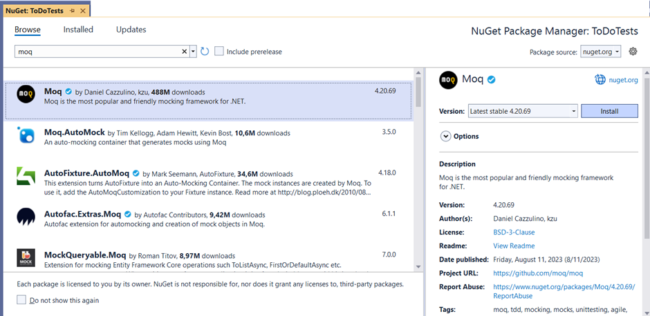

# Memory Spel
**Onderwerpen:** Object oriëntatie, applicatielagen, grafische UI, unit-testen  
**Complexiteit:** (college, homework) scaffold (yes/no), , novice, advance 

## Opdrachtbeschrijving
Maak een memory spel met verschillende grafische interfaces (Console en WPF of MAUI). In de applicatie architectuur worden lagen aangebracht.

## Functionele eisen
Het basis memory spel kan door 1 speler gespeeld worden en heeft minimaal 10 kaarten (5 paren). Van een uitgespeeld spel wordt een score bijgehouden in een lijst van highscore ’s (top 10).
In een uitgebreidere versie van het spel kunnen spelers het aantal kaarten instellen en eigen afbeeldingen van kaarten invoeren. 
De highscore wordt berekend op basis van het aantal kaarten en de tijdsduur waarmee het spel uitgespeeld wordt. Het aantal kaarten telt dubbel zo zwaar mee als het aantal pogingen en de tijdsduur. Over alle gespeelde spellen wordt een top 10 van highscores bijgehouden.

## Non-functionele eisen
-	Het spel kan gespeeld worden in een Console én in een WPF (of MAUI) applicatie.
-	In de WPF (of MAUI) applicatie kan het aantal kaarten om mee te spelen opgegeven worden.
-	In de WPF (of MAUI) applicatie kunnen eigen afbeeldingen van kaarten in het spel gebruikt worden.
-	De applicatie is opgebouwd in lagen, waarbij UI, Business en Data (persistence) gescheiden zijn. De lagen die herbruikbaar zijn door de Console en WPF/ MAUI applicatie worden gedeeld.
-	De oplossing maakt gebruik van zelf gedefinieerde class libraries, classes, interfaces, enums, methods, properties, constructors, events, delegates en exceptions.
-	Kwaliteit is in de code aangebracht door o.a. dubbele code te vermijden, standaard naamgevingsconventies aan te houden, defensieve aard van de code en het voorzien van commentaar op een gestandaardiseerde manier.
-	Implementeer de applicatie in lagen waarbij het domein als een geïsoleerde laag getest kan worden met unit-testing. Er zijn unit-testen geschreven voor alle business functionaliteiten. Er wordt rekening gehouden met de impliciete scenario’s die voortvloeien uit de gestelde eisen.
-	De high-scores en afbeelding voor de kaarten worden opgeslagen in het (file/database)systeem.
-	In WPF of MAUI wordt gebruik gemaakt van databinding.

## Test procedure
-	Speel een spel in een console applicatie en speel een spel in een WPF (of MAUI) applicatie.
-	Voer een eigen set van afbeeldingen in.
-	Speel een spel met eigen afbeeldingen en een gekozen aantal kaarten.
-	Schrijf een lijst van unit testen om de correcte werking van de gestelde eisen aan te tonen. 
-	Voer de unit-testen uit.

## Test resultaat
-	Meerdere spellen kunnen gespeeld worden waarvan de highscores bijgehouden worden.
-	Een spel kan met verschillende aantal en eigen kaarten gespeeld worden en de highscores worden weergegeven.
-	De unit-testen slagen

## Ondersteunende informatie
Een memory spel is een spel waarbij meerdere kaarten op de kop de liggen. Per beurt mogen twee kaarten omgedraaid worden. Wanneer twee dezelfde kaarten omgedraaid worden, blijven ze omgedraaid liggen anders worden ze weer terug gedraaid. Wanneer alle kaarten omgedraaid zijn is het spel afgelopen en wordt de highscore getoond. 
Highscore
Van de gespeelde spellen wordt een lijst van highscores bijgehouden. Alleen wanneer een highscore in de top 10 komt, wordt de score opgeslagen.
Het aantal kaarten, de tijd en het aantal pogingen bepalen de score. ((Aantal kaarten)2 / (Tijd in seconden * aantal pogingen)) * 1000

|--|--|--|--|
|Aantal kaarten| Tijd| Aantal pogingen| Score|
|--|--|--|--|
|4|10|2|(16 / 20 => 0,8) * 1000 => score:  800|  
|10|20|5|10	20	5	(100 / 100 = 1) * 1000 => score: 1000|
|4|20|2|(16 / 40 = 0,4) * 1000 => score: 400|
|4|10|3|(16 / 30 = 0,53) * 1000 => score: 533|

## Verduidelijking van de eisen
-	Van iedere unieke kaart zijn er maximaal twee in een spel.
-	Kaarten worden willekeurig gepositioneerd bij ieder spel dat gespeeld wordt.
-	Wanneer het spel gestart wordt liggen alle kaarten omgekeerd.
-	Voor iedere unieke kaart is een duplicaat in het spel.
-	De weergave van de highscores bevat minimaal de naam van de speler, de score en het aantal kaarten van het gespeelde spel.
-	Het spel in de Console applicatie heeft standaard 5 unieke kaarten die bijvoorbeeld een nummer, teken, tekst of figuur met of zonder kleur weergeven.
-	Het spel in de WPF (of MAUI) applicatie kan gespeeld worden met eigen afbeeldingen op de kaarten en kan het aantal kaarten ingesteld worden.

## Applicatie architectuur
-	Zet de applicatie in lagen op volgens de ‘The big three’: UI, Business, DataAccess.
-	Begin met een opzet in de code waarbij je de logica van het spel kunt getest kan worden zonder dat je de UI of gegevensopslag gebruikt.
-	Je hebt een solution met (minimaal) één project voor de Console applicatie, één project voor de WPF (of MAUI) applicatie en één voor de business logica en één voor de data access logica. Het project voor de business logica heeft geen verwijzing naar een van de andere projecten. De andere projecten mogen wel naar elkaar of naar het business project verwijzen.

## Database aanmaken
Gebruik in Visual Studio de SQL Server Object Explorer om een MsSql LocalDb database aan te maken. Een andere mogelijkheid is een SqLite of MariaDb database. Je kunt een designer gebruiken om een tabel aan te maken of een create table script uitvoeren. 

# Testen met Moq
Mocking helpt je om het gedrag van het object dat je wilt testen te isoleren van zijn afhankelijkheden. De "mocks" zijn gesimuleerde versies van objecten of componenten waarvan de code die je wilt testen gebruik maakt. 

-	NuGet package Moq toevoegen aan testproject via NuGet Package manager
-	Mock de data access laag zodat de business laag getest kan worden zonder dat een ander project aangesproken hoeft te worden. Er is dus geen Sql-Server database nodig om unit-testen uit te voeren. De mock vervangt dus de data-access laag én de database met data.

## Extra uitdaging (optioneel)
Mocht je extra uitdaging willen dan kun je de volgende uitbreidingen aanbrengen:
-	In plaats van een match op twee gelijke kaarten, kunnen spellen gespeeld worden waarbij er drie (of meer) gelijke kaarten omgedraaid moeten zijn.
-	De kaarten bewegen en verplaatsen zich, bijvoorbeeld op een draaiplaat of in een cirkel.
-	MVVM wordt als UI pattern in WPF of MAUI aangehouden.
-	Het spel kan met meerdere spelers gespeeld worden (toenemende moeilijkheid: in hetzelfde venster, op hetzelfde systeem met meerdere applicaties, over verschillende systemen in een netwerk)
-	Stel de applicatie beschikbaar, waarbij deze geïnstalleerd en gebruikt kan worden buiten de ontwikkelomgeving om.

Uiteraard mag je zelf ook de opdracht uitbreiden met je eigen ideeën.

